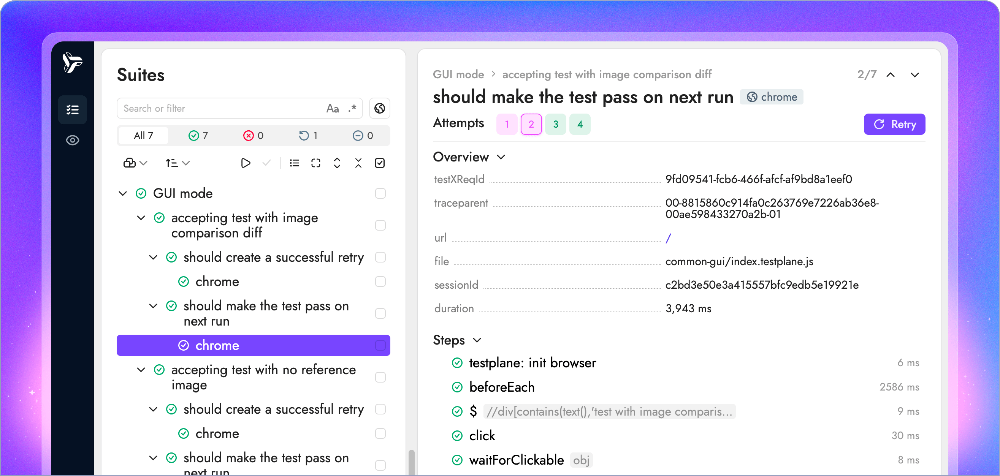

<p align="center">
    <picture>
        <source media="(prefers-color-scheme: dark)" srcset="docs/images/html-reporter-dark.svg" width="300">
        <source media="(prefers-color-scheme: light)" srcset="docs/images/html-reporter-light.svg" width="300">
        
    </picture>
</p>

<h3 align="center">Sleek and informative UI for your tests 🚀</h3>

<p align="center">
    <a href="https://testplane.io"></a>
    <a href="https://www.npmjs.com/package/html-reporter"></a>
    <a href="https://github.com/gemini-testing/html-reporter/releases"></a>
    <a href="https://github.com/gemini-testing/html-reporter/blob/master/LICENSE"></a>
    <a href="https://t.me/testplane"></a>
</p>



<br/>

`html-reporter` or, as we also call it, Testplane UI — is an open-source project that can be used to view test results or interact with tools like [Testplane](https://testplane.io), [Playwright](https://playwright.dev/) or [Jest](https://jestjs.io/).

## Features

#### Run and debug your tests

View test steps, replay them and when something goes wrong, find the root cause with ease.


#### Superb visual testing capabilities

Accept or undo changes in visual checks with one click. Multiple viewing modes and dedicated visual checks tab will help you analyze the difference.


#### Unified UI for CI and local usage

Something went wrong in CI? Pull the report and continue troubleshooting locally.


#### Powerful analytics

Spot flaky tests, slow tests or other issues using "sort by" and "group by" options.


#### And so much more

Benefits over regular reporters include:

- **More than a reporter**: it's not static, you can run your tests, update reference images, analyze test runs and more.
- **Save developer time**: no need to relaunch reports or switch terminals during development — the whole workflow is possible from the UI.
- **No vendor lock-in**: all data is yours, the UI is open-source and everything is running locally on your machine. There's no cloud.
- **Optimized to work at scale**: doesn't matter if you have 100 or 100,000+ tests in one report — the UI will work just as smoothly. Built-in support for artifacts uploading on the fly to S3 or other storage.
- **Multiple data sources**: html-reporter can pull and merge data from any amount of data sources at runtime, or you can use dedicated merge-reports command.

## Demo

One link is worth a thousand words, so [here it is](https://storage.yandexcloud.net/testplane-ui-demo/v10.16.3/new-ui.html#/suites/testplane%20New%20UI%20Suites%20page%20Expand%2Fcollapse%20suites%20tree%20button%20should%20offer%20to%20expand%20when%20collapsed%20using%20button%20chrome) — see all the features for yourself.

## Getting started

> [!IMPORTANT]
> Currently `html-reporter` needs Node v18 or higher and works with Testplane, Playwright and Jest.
>
> Note that html-reporter is tool-agnostic at its core, so adding support for a new tool is a matter of implementing new data adapters. If you have a specific tool in mind, [raise an issue](https://github.com/gemini-testing/html-reporter/issues) — let's discuss what can be done.

1. Install `html-reporter` with your favorite package manager:

    ```shell
    npm i -D html-reporter
    ```

2. Turn it on in your tool's config:

    <details>
        <summary>Testplane</summary>

        // .testplane.config.ts
        export = {
            // ...
            plugins: {
                'html-reporter/testplane': {
                    enabled: true,
                    path: 'html-report',
                },
            },
        };

    </details>

    <details>
        <summary>Playwright</summary>

        // playwright.config.ts
        export default defineConfig({
            // ...
            reporter: [
                ['html-reporter/playwright', {
                    enabled: true,
                    defaultView: 'failed',
                    path: 'html-report',
                }],
            ],
        });

    </details>
    <details>
        <summary>Jest</summary>

        const config = {
            // ...
            reporters: [
                ['html-reporter/jest', {
                    path: 'html-report',
                }]
            ],
        };

    </details>

3. Run your tests and see the report:

    ```shell
    npm test

    npx serve html-report
    ```

4. Try UI mode to run your tests from the UI:

    ```shell
    npx html-reporter gui
    ```

    Note: UI mode is available only for Testplane and Playwright. To use with Playwright, add `--tool playwright`.

## Docs

See full documentation in various languages here:
* [English](https://testplane.io/docs/v8/html-reporter/overview/)
* [Русский](https://testplane.io/ru/docs/v8/html-reporter/overview/)

## Contributing

Our mission with this repository is to make the development process open, while continuing to improve upon its features, performance and ease of use. We hope other organizations find value in our project and benefit from our work.

We welcome and appreciate community contributions. To ensure our efforts are in sync, we recommend to raise an issue or leave a comment beforehand.

Visit our [contributing guide](CONTRIBUTING.md) to understand more about our development process and how to get involved.

## License

Testplane is [MIT licensed](LICENSE).
